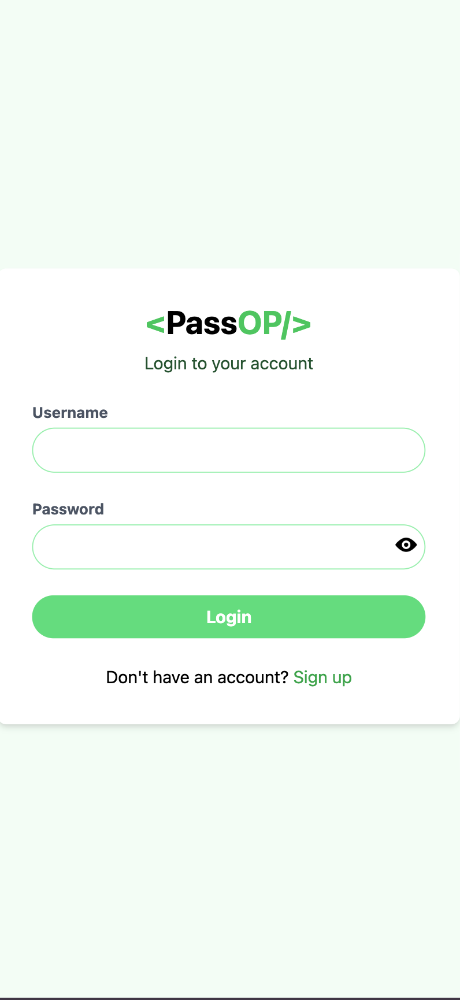
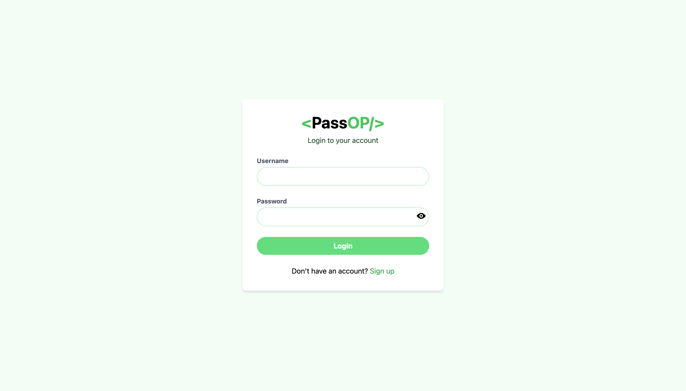
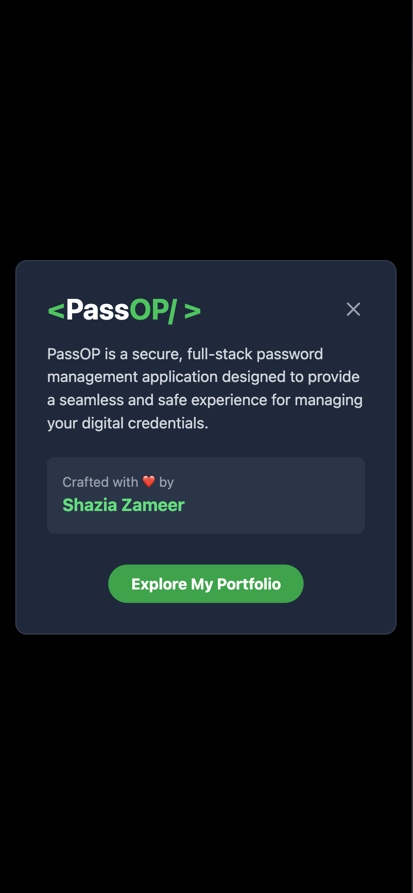
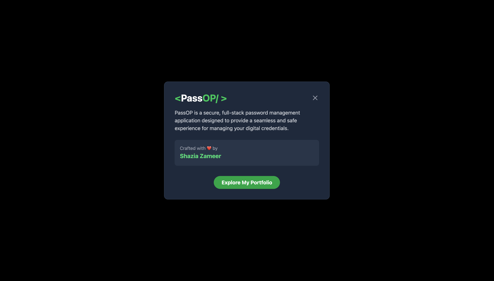
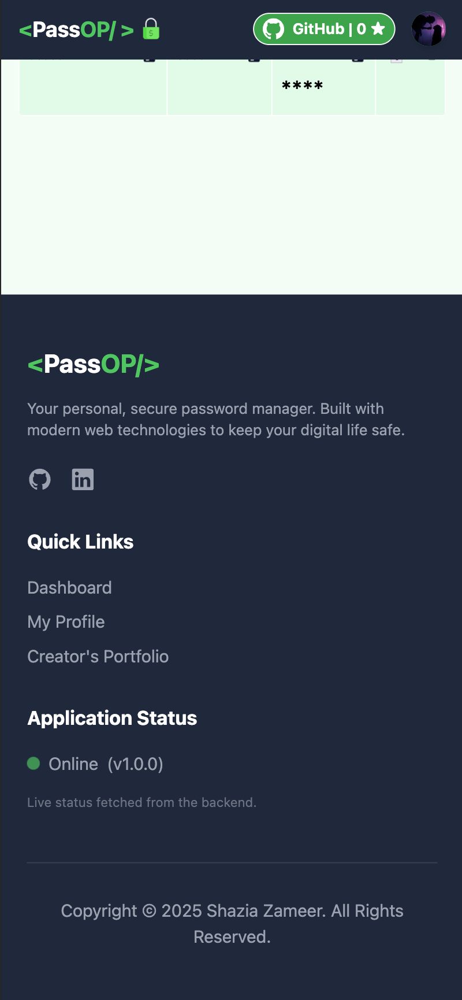
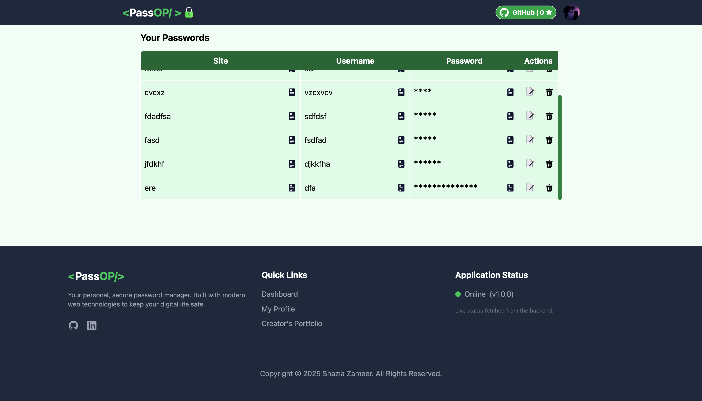
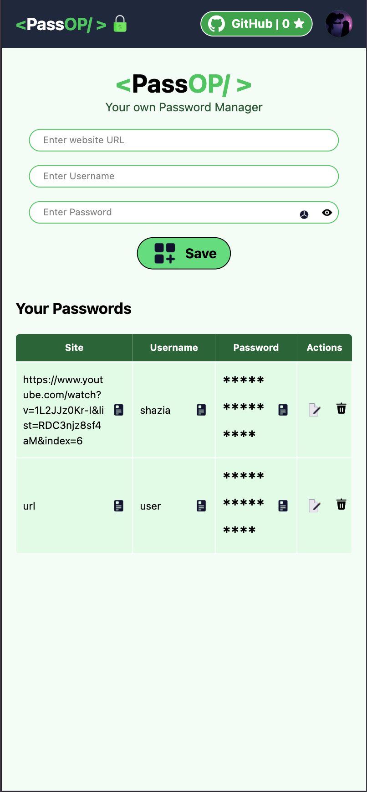
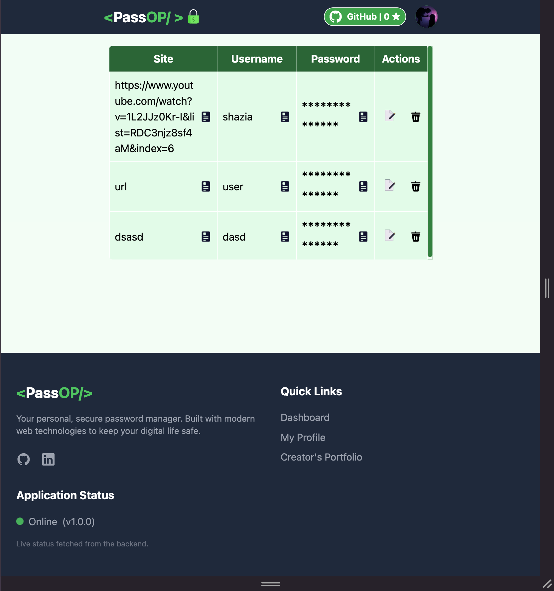

<h1 align="center">
  <a href="">
    
  </a>
</h1>


<p align="center">
  <em>A secure, modern, full-stack password manager built from scratch with the MERN stack.</em>
</p>

<p align="center">
  
  
  
  
  
</p>

---

## 🎬 Project Demo

A quick walkthrough of PassOP's core features in action.

<div align="center">
  
  **
  
  
</div>

---
### A Slick & Modern UI:

- The whole thing is built with Tailwind CSS, so it looks great on any device.

- The navbar has a cool profile dropdown that shows your info.

- It even shows the live star count from the project's GitHub repo!

- You'll get nice little pop-up notifications for pretty much everything you do.

- Plus, there are lots of fun hover effects and interactive icons!

---

## ✨ Key Features

* 🔐 **Secure Authentication:** Full user signup and login system using JWT for sessions and `bcryptjs` for password hashing.
* 🗄️ **Private Password Vault:** Once logged in, a user's password vault is completely private and accessible only to them.
* ✍️ **Full CRUD Functionality:** Easily **C**reate, **R**ead, **U**pdate, and **D**elete any saved password.
* 👤 **Customizable User Profiles:** Users can upload their own profile picture, which is handled by a `multer`-powered backend.
* 🛡️ **Enhanced Security:** To change a password, users must first verify their current password for an extra layer of security.
* 🎲 **Strong Password Generator:** Can't think of a good password? The app can generate a strong, random one instantly.
* 📱 **Slick & Responsive UI:** Built with Tailwind CSS, the interface is modern, clean, and looks great on any device, from mobile to desktop.
* 🔔 **User-Friendly Notifications:** Get toast notifications for all major actions, providing clear user feedback.

---
### 📸 Screenshots(Responsiveness)

<table>
<tr>
<td align="center"><strong>Phone view</strong></td>
<td align="center"><strong>Laptop/Tablet view</strong></td>
</tr>
<tr>
<td></td>
<td></td>
</tr>
<tr>
<td></td>
<td></td>
</tr>
<tr>
<td></td>
<td></td>
</tr>
<tr>
<td></td>
<td></td>
</tr>

</table>


[](https://skillicons.dev)


## 🛠️ Tech Stack

| Category      | Technology                                                                                                                                                                                                                                  |
| ------------- | ------------------------------------------------------------------------------------------------------------------------------------------------------------------------------------------------------------------------------------------- |
| **Frontend** | `React`, `Vite`, `React Router`, `Tailwind CSS`                                                                                                                                                                                               |
| **Backend** | `Node.js`, `Express.js`                                                                                                                                                                                                                     |
| **Database** | `MongoDB`                                                                                                                                                                                                                                   |
| **Auth** | `JSON Web Tokens (JWT)`, `bcryptjs`                                                                                                                                                                                                           |
| **File Upload** | `Multer`                                                                                                                                                                                                                                    |

---

## 🚀 Getting Started

To get a local copy up and running, just follow these simple steps.

### Prerequisites

Make sure you have these things installed before you start:
* [Node.js](https://nodejs.org/en/) (v18 or newer)
* [npm](https://www.npmjs.com/) (usually comes with Node)
* [MongoDB](https://www.mongodb.com/try/download/community) (make sure the service is running!)

### Installation & Setup

1.  **Clone the Repository**
    ```sh
    git clone [https://github.com/Shazia-Zameer-999/PassOP-Password-Manager.git](https://github.com/Shazia-Zameer-999/PassOP-Password-Manager.git)
    ```
2.  **Navigate to the Project Directory**
    ```sh
    cd PassOP-Password-Manager
    ```
3.  **Install Frontend Dependencies**
    ```sh
    npm install
    ```
4.  **Install Backend Dependencies**
    ```sh
    cd backend
    npm install
    ```
5.  **Set Up Environment Variables**
    * In the `backend` folder, create a new file named `.env`.
    * Add these two lines, replacing the placeholder values with your own secret keys:
        ```env
        MONGO_URI=your_mongodb_connection_string_here
        JWT_SECRET=your_super_secret_and_long_jwt_key_here
        ```
6.  **Run the Application**
    You'll need two separate terminals open to run both the frontend and backend servers.

    * **Terminal 1 (Backend):**
        ```sh
        cd backend
        nodemon server.js
        ```
    * **Terminal 2 (Frontend):**
        ```sh
        npm run dev
        ```
That's it! The app should now be running at **http://localhost:5173**.


[](https://github.com/anuraghazra/github-readme-stats)
---


[](https://github.com/anuraghazra/github-readme-stats)


[](https://github.com/ryo-ma/github-profile-trophy)

----

<p align="center">
Built with ❤️ by Daten Diva.
</p>